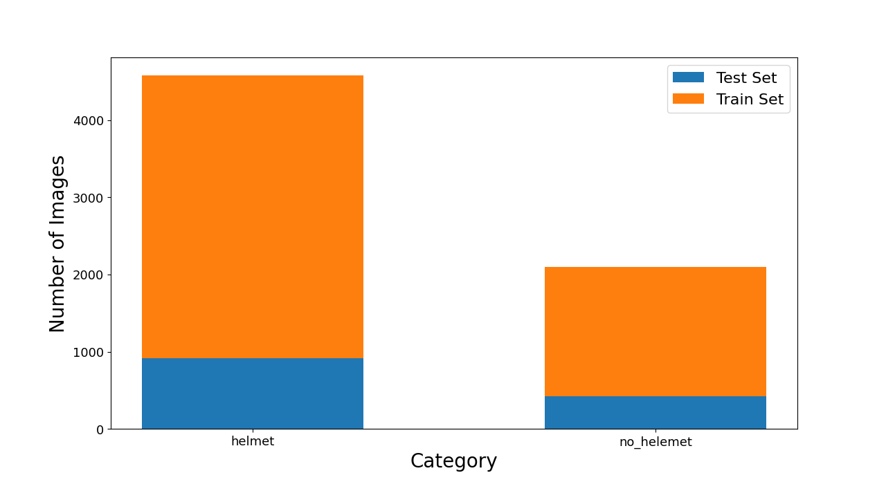

# Helmet Classification with ResNet-50

このプロジェクトは、**ResNet-50** をベースとした画像分類モデルを用いて、作業員の**ヘルメット着用・未着用**を自動判定するシステムです。

## 1. プロジェクト概要

現場の安全管理を自動化することを目的とした画像認識プログラムです。

転移学習（Transfer Learning）を適用し、検証データセットにおいて高い識別精度を実現しています。

### 性能実績

| **ターゲット**     | **ベストモデル精度 (Accuracy)** | **判定クラス**          |
| ------------------ | ------------------------------- | ----------------------- |
| 工事現場ヘルメット | **99.64%**                      | 着用 / 未着用 (2クラス) |

------

## 2. データセットの統計 (Dataset Statistics)
学習に使用したデータセットの内訳です。



| カテゴリ               | 学習データ (Train) | テストデータ (Test) |
| :--------------------- | :----------------: | :-----------------: |
| **Helmet (着用)**      |       ~3,700       |        ~900         |
| **No Helmet (未着用)** |       ~1,700       |        ~400         |

---

## 3. プロジェクト構成 (Project Structure)
本プロジェクトのファイル構成は以下の通りです。

```
.
├── data/               # 訓練・検証用データセット
├── logs/               # 学習済みモデル（.pth）および学習ログ
├── nets/               # ネットワーク定義（ResNet-50等）
├── utils/              # 共通ユーティリティ関数
├── .gitignore          # Git管理除外設定
├── config.py           # プロジェクト全体の各種設定
├── get_ap.py           # モデルの評価・精度算出スクリプト
├── prediction.py       # 推論・判定テスト実行用
├── test_net.py         # モデル構造の確認・デバッグ用
├── train.py            # 学習メイン処理
└── README.md           # 本ドキュメント
```

------

## 4. 環境構築 (Requirements)

- Python 3.8+
- PyTorch 1.7.1
- torchvision 0.8.2
- tqdm, pandas, opencv-python

------

## 5. 使用方法 (Usage)

### a. 設定の変更

学習率、バッチサイズ、データパス等はすべて **`config.py`** で一括管理しています。環境に合わせて書き換えてください。

### b. モデルのデバッグ

ネットワークのパラメータ数や入出力サイズを確認する場合：

Bash

```
python test_net.py
```

### c. 学習の開始

データセットを `data/` に配置後、以下のコマンドで学習を開始します。

Bash

```
python train.py
```

### d. 精度評価

`logs/` フォルダ内のモデルを評価し、精度（Accuracy）を算出します。

Bash

```
python get_ap.py
```

### e. 推論テスト

学習済みモデルを使用して、実際の画像に対して推論を行います。

Bash

```
python prediction.py
```

------

## 6. 参考・引用 (Reference)

- [bubbliiiing/faster-rcnn-pytorch](https://github.com/bubbliiiing/faster-rcnn-pytorch) - プロジェクト構成の参考

